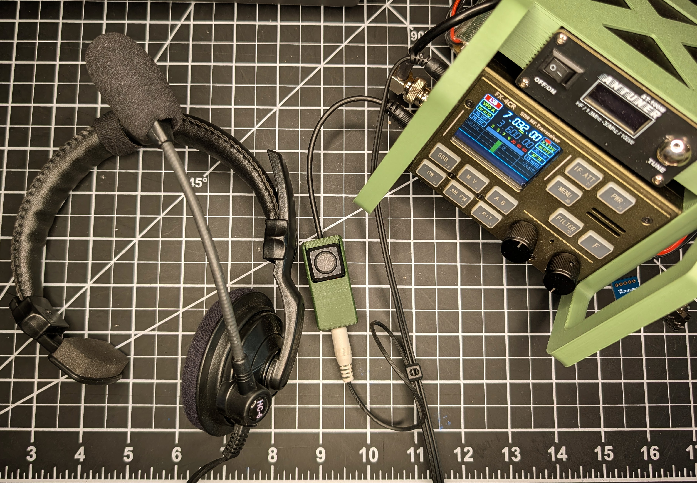
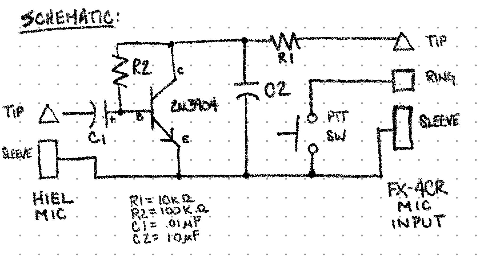
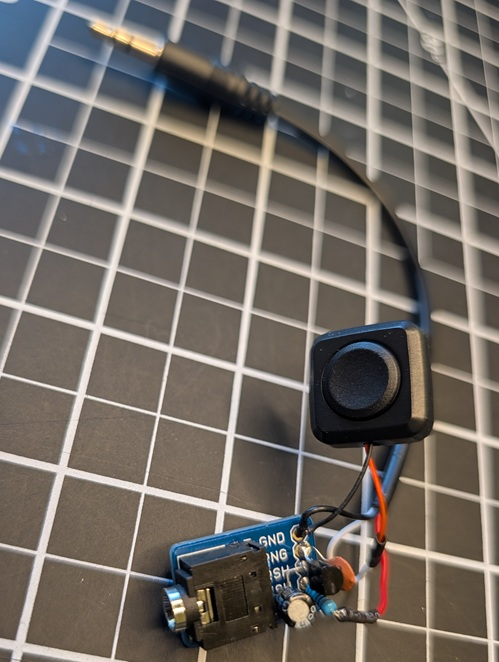
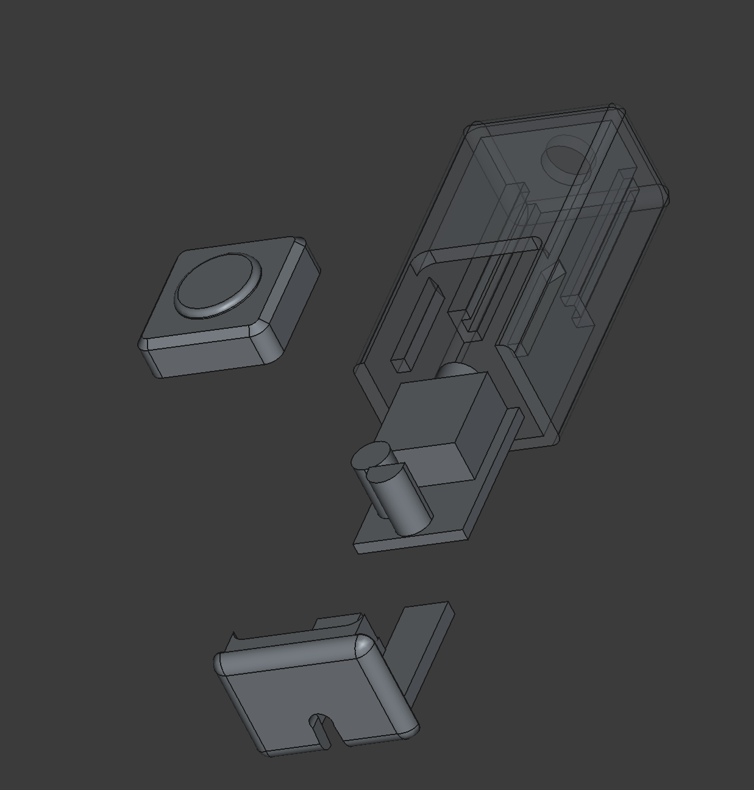

# FX-4CR Dynamic Mic Preamp w/PTT (Heil Micro Pro Adapter)
This project provides a simple, high-performance active preamplifier designed to adapt low-impedance dynamic microphones—specifically the Heil Micro Pro Headset—to the FX-4CR QRP transceiver.

## Background

The FX-4CR was designed for high-impedance electret microphones. When using a low-impedance dynamic headset like the Heil Micro Pro, two issues arise:

1. **Signal Level:** The dynamic element output is too low for the radio's internal preamp, resulting in faint or non-existent audio.

2. **Firmware Compatibility:** Using **F5BUD's V2 Firmware**, (I believe) the radio performs a startup check on the microphone line. A low-impedance dynamic mic looks like a near-short to the DC bias sensing logic. In my experience, the firmware will detect this as a fault and **prevent the radio from powering up** to protect the internal circuitry.

This "Parasitic Power" circuit solves both issues by providing the necessary gain and presenting the correct impedance/DC load to the radio.

## Features

* **No External Power:** Runs off the DC bias provided by the FX-4CR MIC jack.
* **Low Noise:** Uses the 2N3904 NPN transistor for clean audio amplification.
* **Firmware Friendly:** Corrects the impedance mismatch so the V2 firmware allows normal boot-up.
* **Compact:** Designed to fit in a 3D-printed enclosure. All the components fit on the TRS breakout board.

## Parts List

| Component | Value | Description |
| :--- | :--- | :--- |
| **Q1** | 2N3904 | NPN Small Signal Transistor (TO-92) |
| **R1** | 10kΩ | Collector Load Resistor (1/4W or 1/8W) |
| **R2** | 100kΩ | Base Bias Resistor (Feedback) |
| **C1** | 10µF | Input DC Blocking Capacitor (Tantalum preferred) |
| **C2** (Opt) | 10nF | RF Bypass Capacitor (Ceramic Disc) |
| **PTT SW** | Momentary Switch | Push Button Switch  |
| **Plug** | 3.5mm TRS M | 3.5mm Male TRS to bare wire |
| **Jack** | 3.5mm TRS F | 3.5mm Female PCB Breakout Board  | 
| **Case** | Custom | 3D Printed STL (included in `/stl` folder) |

## Schematic

*The circuit uses a Collector-Feedback Bias configuration. This provides stable gain and handles the "parasitic" power extraction from the radio's MIC line.*

### TRS Breakout board

I found the breakout board perfect for providing a secure platform for soldering all the components of the amplifier and switch. Since there are only two contacts needed for the Hiel Mic, The TSH and RSH contacts can be removed for the jack so that their pads on the pcb can be repurpose for mounting the components. Ring and Sleve were also jumpered to provide more GND solder contacts. 

## 3D Printing & Assembly

The `/stl` directory contains the files for the case.

* **Print Settings:** 0.2mm layer height, PETG or PLA+.
* **Assembly:** The circuit is small enough to be "dead-bug" soldered if you don't want to use the breakout board and case. I was a lazy with the case design so the cap is superglued in place you may wish to remix to a snap fit design.
* **RFI Note:** In my testing the 10nF cap was sufficient to keep RFI off the mic input, you may also which to mitigate with a ferrite bead.

## License

This project is released under the MIT License. Feel free to modify and share.

---
*Developed and tested by Barry Shaffer (KD3Q) for the FX-4CR community.*
